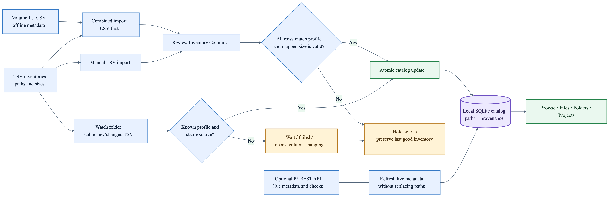
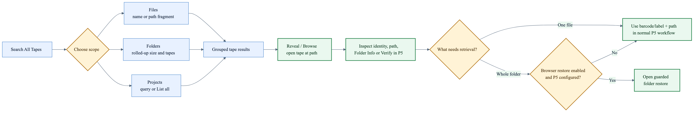
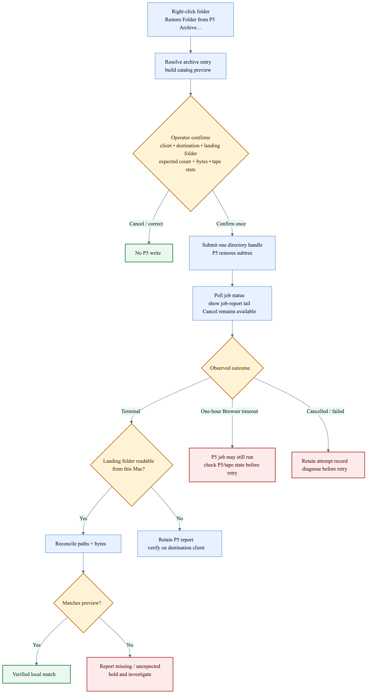

# P5 Archive Browser — Illustrated Workflow Guide

**Status:** Current workflow companion — v0.31 build 42
**Canonical detail:** [P5 Archive Browser — User Guide](USER_GUIDE.md)
**Audience:** Archive operators, assistants, and technical reviewers

This guide shows how P5 Archive Browser turns exported inventory into a
searchable local catalog, helps an operator identify the right tape, and
optionally submits a guarded whole-folder restore to Archiware P5. It is a
visual companion to the canonical User Guide, not a replacement for it.

## Capability and safety boundary

P5 Archive Browser is local-catalog first. Importing, browsing, searching,
Folder Info, notes, Archive Groups, backups, and P5 verification do not modify
the P5 server. **Restore Folder from P5 Archive** is the only P5 write path. It
is off by default and always requires an explicit confirmation.

Current behavior:

- Imports supported six- and eight-column TSV inventories only after schema and
  size validation. A rejected replacement leaves the last good inventory
  intact.
- Uses TSV data for paths and sizes, CSV for offline volume metadata, and the
  optional P5 REST API for live metadata and verification.
- Searches Files, Folders, and derived Projects across tapes, then reveals a
  result in the per-tape browser.
- Restores one whole folder subtree when restore is enabled and P5 is
  configured. When the destination is readable from this Mac, Browser
  independently reconciles landed paths and bytes with the local preview.
- Records every restore attempt and preserves durable watch-folder attempts and
  source provenance.

Current limits:

- Individual-file restore is not supported.
- Automatic watch-folder import handles TSV inventories; the volume-list CSV
  remains a separate manual import.
- Folder totals come from imported rows and do not yet distinguish directory
  rows or de-duplicate versioned entries across tapes.
- P5 does not expose a distinct per-job "waiting for tape" state through the
  endpoint Browser polls. A one-hour Browser timeout means the P5 job may still
  be running.
- Server identity and routing are still single-server. Named multi-server
  support is planned.

## 1. Build a trusted local catalog



The recommended first import is **Import ▸ Import Archive Folder (CSV + TSV)…**.
Browser imports the optional volume-list CSV first so the validated TSV
inventories can attach to real P5 labels immediately. Separate CSV and TSV
imports remain available.

1. Prepare one supported inventory per volume. P5 Archive Export/direct
   `nsdchat` produces six columns; P5 Web GUI Volume Inventory produces eight.
2. Choose a file, a TSV folder, or the combined archive-folder import.
3. Review the detected profile and ordered field mapping before the manual
   import changes the catalog.
4. Let Browser validate every non-empty row and the mapped nonnegative size.
5. If validation succeeds, Browser atomically replaces that volume's file
   inventory and schedules search/Projects maintenance.
6. If validation fails, stop and inspect the source. Browser preserves the last
   successful inventory.

For later exports, **Settings ▸ Watch Folder** can monitor the root plus one
generation-folder level. New or changed TSVs wait until stable, network sources
are staged locally, and unchanged fingerprints are skipped. An unsupported
layout becomes `needs_column_mapping`; background import never guesses.

### What each source owns

| Source | Provides | Does not prove |
| --- | --- | --- |
| TSV inventory | Archived paths, mapped sizes, schema/source provenance | Current tape online state or P5 job state |
| Volume-list CSV | Offline labels, barcodes, state, type, used size, location | Browsable tape contents |
| P5 REST API | Live volume metadata, indexes/plans, path verification, restore jobs | That every expected file landed after a restore |
| Operator fields | Alias, location, notes, Archive Groups | P5-reported metadata |

## 2. Find the tape and inspect the evidence



1. Select **Search All Tapes**.
2. Choose **Files**, **Folders**, or **Projects**.
3. Enter at least three characters for Files or Folders. For Projects, leave the
   query blank and choose **List** to see all derived projects.
4. Read grouped results by tape. Tape rows expose the best available identity,
   generation evidence, location, and live online/offline state.
5. Double-click a result or choose **Reveal/Browse** to open the tape at the
   selected path.
6. Use **Folder Info** for a read-only per-tape and cross-tape roll-up. Use
   **Verify in P5** on a file when a live server check is useful.
7. Choose the retrieval path:
   - For one file, or when Browser restore is disabled, use the displayed
     barcode/label and full path in the normal P5 workflow.
   - For a whole folder, use Browser's guarded restore workflow if it is enabled
     and configured.

## 3. Restore one whole folder through P5



1. In **Settings ▸ Restore**, enable restore and set default destination values.
   The destination path belongs to the selected P5 client; it is not
   necessarily a path on this Mac.
2. Right-click a folder and choose **Restore Folder from P5 Archive…**.
3. Review the confirmation sheet:
   - source folder;
   - catalog-derived expected count and bytes for the selected tape;
   - current online/offline state;
   - destination client and path;
   - computed landing folder.
4. Confirm once. Browser resolves the P5 archive entry and submits one directory
   handle, which restores the subtree.
5. Monitor the P5 status and the tail of its job report. Cancel remains
   available while Browser watches.
6. Interpret the outcome:
   - **P5 terminal + local destination readable:** Browser compares paths and
     bytes and reports match, missing, or unexpected output.
   - **P5 terminal + destination not readable here:** retain the P5 report and
     verify on the destination client.
   - **Browser timeout:** the P5 job may still be active, including while
     waiting for an offline tape. Check P5 directly before retrying.
   - **Cancelled or failed:** preserve the attempt record and diagnose before
     another submission.

The preview describes only the selected tape's catalog rows. A folder archived
across multiple tapes can require another tape and P5 may restore more than the
preview counted.

## Failure and recovery

| Signal | Hold action | Safe next check |
| --- | --- | --- |
| Unknown, mixed, shifted, malformed, or invalid TSV | Do not replace catalog data | Re-export in a supported profile; review columns again |
| Watched source is incomplete or unstable | Leave it queued | Let the file stabilize or use **Check Now** after reconnecting storage |
| Duplicate sources conflict for one volume | Keep the last good inventory | Remove ambiguity; retry only the intended source |
| P5 configuration or connection fails | Do not submit restore | Test the connection and confirm the configured server/index |
| Restore preview does not show the intended landing folder | Cancel at confirmation | Correct destination client/path; reopen the preview |
| Browser stops watching after one hour | Do not assume job failure | Inspect the P5 job and tape state directly |
| P5 says complete but local reconciliation differs | Treat as incomplete | Retain the result, inspect missing/extra paths, and verify before retry |
| Catalog maintenance is required | Back up first | Use **Settings ▸ Catalog Data**; reset cannot proceed without its automatic backup |

## Evidence map

| Workflow claim | Public operator reference | Public release evidence |
| --- | --- | --- |
| Schema-safe import and preservation of the last good inventory | [`USER_GUIDE.md`](USER_GUIDE.md) | [`RELEASE_NOTES.md`](RELEASE_NOTES.md) and [`TESTER_NOTES.md`](TESTER_NOTES.md) |
| Stable, deduplicated watch imports and hold states | [`USER_GUIDE.md`](USER_GUIDE.md) | [`RELEASE_NOTES.md`](RELEASE_NOTES.md) |
| Cross-tape Files, Folders, and Projects workflows | [`USER_GUIDE.md`](USER_GUIDE.md) | [`TESTER_NOTES.md`](TESTER_NOTES.md) |
| Restore is opt-in and confirmation-gated | [`USER_GUIDE.md`](USER_GUIDE.md) | [`RELEASE_BLURB_0.30_BUILD_37.md`](RELEASE_BLURB_0.30_BUILD_37.md) |
| Restore polling, timeout meaning, and attempt history | [`USER_GUIDE.md`](USER_GUIDE.md) | [`RELEASE_BLURB_0.31_BUILD_42.md`](RELEASE_BLURB_0.31_BUILD_42.md) |
| Independent local path/byte reconciliation | [`USER_GUIDE.md`](USER_GUIDE.md) | [`TESTER_NOTES.md`](TESTER_NOTES.md) |
| Catalog backup and backup-gated reset | [`USER_GUIDE.md`](USER_GUIDE.md) | [`RELEASE_NOTES.md`](RELEASE_NOTES.md) |

The source repository's standalone smoke tests use temporary SQLite fixtures
and do not contact a real P5 server or live catalog. This public documentation
repository intentionally contains no application source or private test
fixtures. Live P5 behavior therefore remains environment- and version-specific.

## Planned improvements

These are planned, not shipped:

- Add operator-facing import history and diagnostics for manual and watched
  imports. Acceptance gate: every import exposes trigger, source, schema,
  mapping, counts, result, and a redacted diagnostic export.
- Add named P5 servers and server-scoped tape identity before routing operations
  to multiple servers. Acceptance gate: identical labels/IDs on two servers
  remain distinct and every P5 action routes by explicit provenance.
- Add portable catalog export/import with versioned manifests and verified
  rollback. Acceptance gate: a catalog can move without losing inventories,
  notes, groups, provenance, or compatibility information.
- Consider individual-file restore only after `targetPath` containment and
  traversal behavior are proven. Acceptance gate: selected files retain their
  intended relative paths and cannot escape the confirmed destination.
- Improve folder totals after directory-row and duplicate/version semantics are
  defined and covered by fixtures.

These are future considerations, not commitments for the current pre-release.
Use [`RELEASE_NOTES.md`](RELEASE_NOTES.md) and
[`TESTER_NOTES.md`](TESTER_NOTES.md) for the current public capability boundary.

## Operator acceptance checklist

- [ ] The running app version matches the procedure being followed.
- [ ] Import source and detected columns were reviewed.
- [ ] No held or conflicting source was allowed to replace trusted inventory.
- [ ] Search result identity, path, and tape were checked before retrieval.
- [ ] Restore remained disabled unless a whole-folder P5 restore was intended.
- [ ] Destination client, destination path, computed landing folder, count, and
      bytes were reviewed before confirmation.
- [ ] A timeout was checked in P5 rather than treated as a completed failure.
- [ ] Local reconciliation or destination-side verification was retained.
- [ ] Catalog backup exists before repair or reset.

## Rebuild the illustrations and PDF

The Mermaid sources and rendered SVG/PNG files live in
[`docs/workflows/p5-archive-browser/`](docs/workflows/p5-archive-browser/).
The same build also generates
[`P5_ARCHIVE_BROWSER_ILLUSTRATED_WORKFLOW_GUIDE.pdf`](P5_ARCHIVE_BROWSER_ILLUSTRATED_WORKFLOW_GUIDE.pdf).
Regenerate the complete set with:

```bash
script/build_p5_archive_browser_workflow_guide.sh
```

The build requires Mermaid CLI through `npx` and Python 3 with ReportLab. Set
`PDF_PYTHON` when ReportLab is installed in a non-default Python environment.
